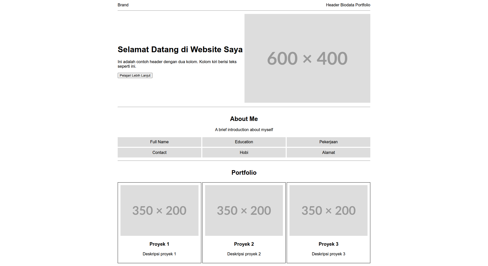

# Tugas Sesi 1 : HTML



## Deskripsi

Tugas sesi 1 adalah projek sederhana untuk menampilkan halaman portfolio dengan tampilan berbasis table.

## Fitur

- Tampilan portfolio menggunakan table

## Dibangun Menggunakan

- HTML5

## Cara Menjalankan

Buka file `index.html` di browser.

## Struktur File

```
├── index.html      # Halaman utama
├── thumbnail.png   # Gambar thumbnail
└── README.md       # Deskripsi
```
