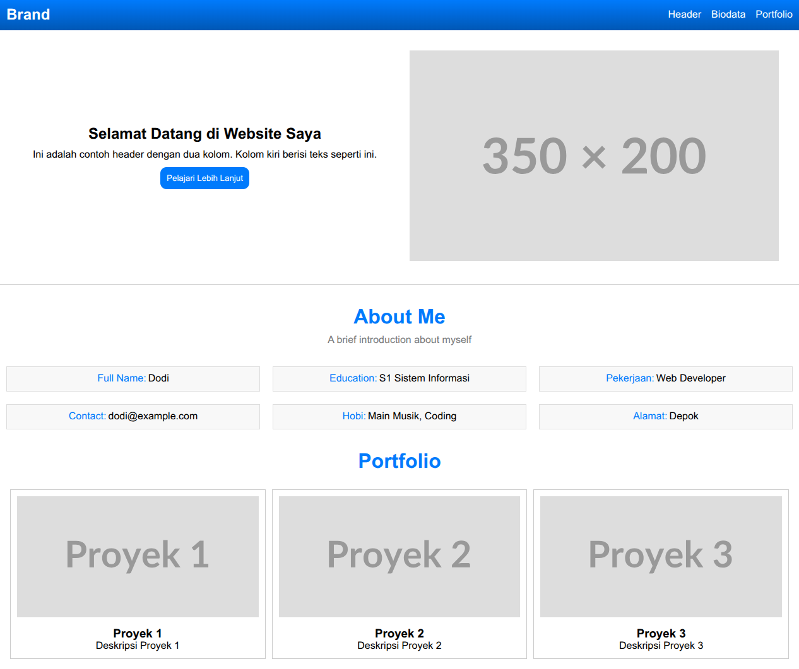

# Tugas Sesi 2 : HTML + CSS



## Deskripsi

Tugas sesi 2 adalah mengubah tampilan portfolio dari tugas sesi 1 menjadi tampilan berbasis CSS.

## Fitur

- Tampilan portfolio menggunakan CSS
- Tampilan portfolio menggunakan grid
- Tampilan portfolio menggunakan div
- Tampilan portfolio menggunakan media query

## Dibangun Menggunakan

- HTML5
- CSS3

## Cara Menjalankan

Buka file `index.html` di browser.

## Struktur File

```
├── index.html      # Halaman utama
├── thumbnail.png   # Gambar thumbnail
├── style.css       # Style CSS
└── README.md       # Deskripsi
```
