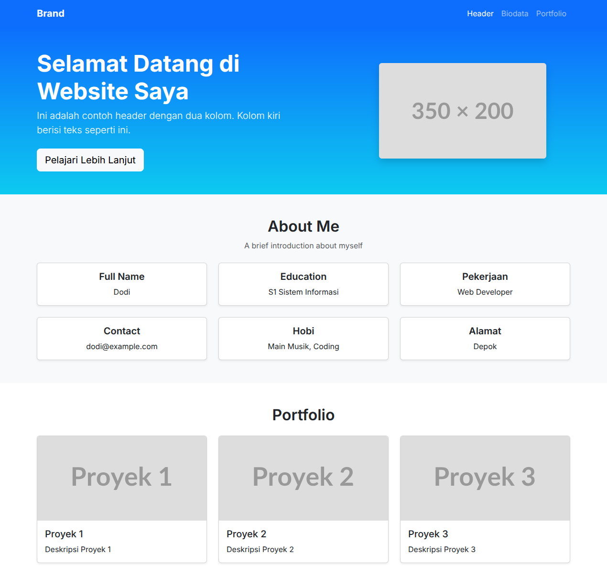

# Tugas Sesi 3 : Bootstrap 5



## Deskripsi

Tugas sesi 3 adalah mengubah tampilan portfolio dari tugas sesi 2 menjadi tampilan berbasis Bootstrap 5.

## Fitur

- Tampilan portfolio menggunakan Bootstrap 5
- Navbar responsif menggunakan komponen Bootstrap
- Hero section dengan grid dan gradien
- About Me menggunakan grid 3 kolom dan kartu
- Portfolio menggunakan kartu (card) dengan grid responsif

## Dibangun Menggunakan

- HTML5
- Bootstrap 5.3

## Cara Menjalankan

Buka file `index.html` di browser.

## Struktur File

```
├── index.html      # Halaman utama
├── thumbnail.png   # Gambar thumbnail
└── README.md       # Deskripsi
```