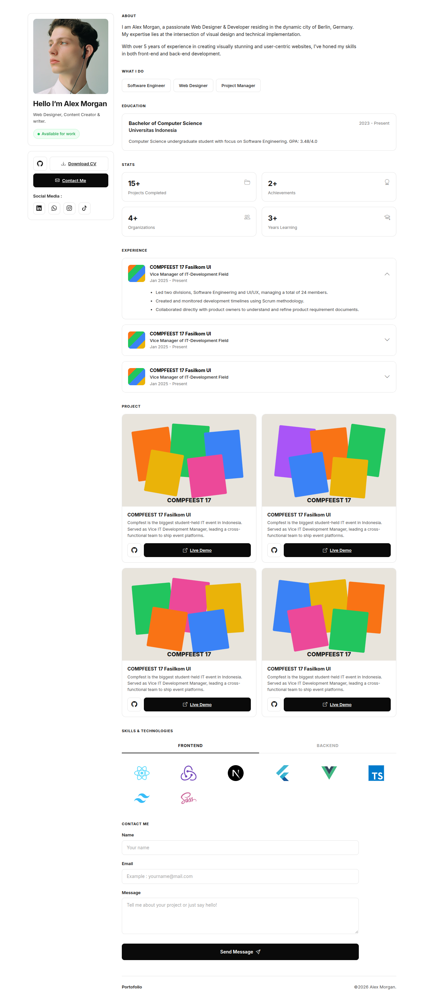

# Tugas Sesi 4 - Bootstrap 5



## Deskripsi

Tugas sesi 4 adalah membuat halaman portfolio programmer bernama `index.html` menggunakan Bootstrap 5.3, mengikuti desain UI yang tersedia pada folder `assets`, serta memakai design token (warna & typography) dari `style.css` yang dikompilasi dari `style.scss`.

## Fitur

- Layout dua kolom: sidebar profil (sticky di desktop) dan konten utama
- Kartu profil dengan foto, status "Available for work", tombol GitHub, Download CV, Contact Me, dan ikon media sosial
- Section About, What I Do, Education, dan Stats
- Experience berupa accordion (collapse) Bootstrap
- Project berupa grid kartu responsif dengan tombol GitHub dan Live Demo
- Skills & Technologies berupa tabs Frontend/Backend dengan ikon teknologi
- Form Contact Me dan footer
- Responsif untuk tampilan desktop dan mobile

## Dibangun Menggunakan

- HTML5
- Bootstrap 5.3
- Bootstrap Icons
- SCSS/CSS Design Tokens (`style.scss` → `style.css`)

## Cara Menjalankan

Buka file `index.html` di browser.

## Struktur File

```
├── index.html           # Halaman utama
├── style.scss           # Sumber design token (SCSS)
├── style.css            # Hasil kompilasi SCSS
├── style.css.map        # Source map SCSS
├── images/
│   └── alex_morgan.jpg  # Foto profil
├── thumbnail.png        # Gambar thumbnail
└── README.md            # Deskripsi
```
