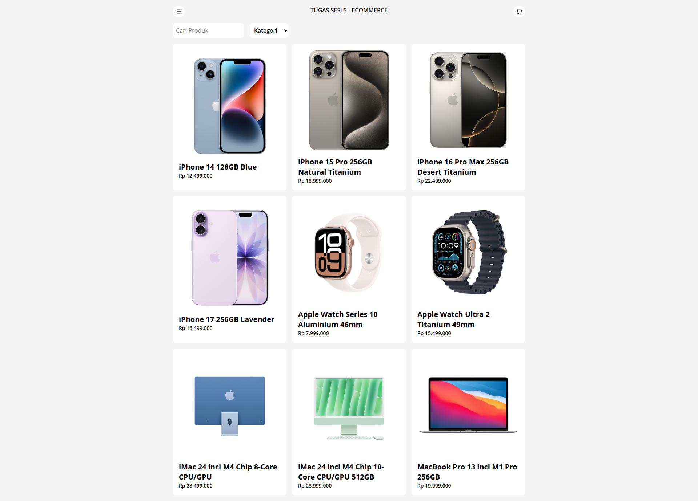

# Tugas Sesi 5 : E-Commerce Product Listing



## Deskripsi

Tugas ini adalah projek sederhana untuk menampilkan daftar produk Apple (iPhone, iWatch, iMac) dengan fitur pencarian dan filter berdasarkan kategori.

## Fitur

- Tampilan produk menggunakan grid layout responsif
- Pencarian produk berdasarkan nama
- Filter produk berdasarkan kategori
- Gambar produk

## Built With

- HTML5
- Tailwind CSS (via CDN)
- JavaScript (Vanilla)
- Lucide Icons

## Cara Menjalankan

Buka file `index.html` di browser.

## Struktur File

```
├── index.html      # Halaman utama
├── products.js     # Komponen produk
├── helpers.js      # Fungsi helper
├── script.js       # Logic utama (data produk & filter)
└── images/         # Aset gambar
```
