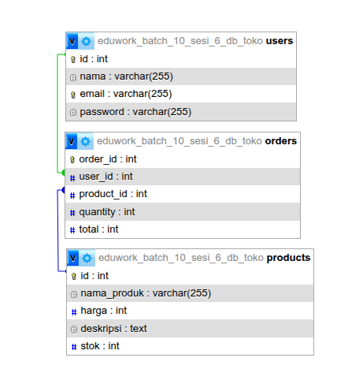

# Tugas Sesi 6 - Database MySQL (CRUD)



## Deskripsi

Tugas ini adalah projek sederhana untuk membuat database MySQL bernama `toko` beserta tabel-tabelnya (`users`, `products`, `orders`) dan mempraktikkan operasi CRUD (Create, Read, Update, Delete) menggunakan query SQL.

## Fitur

- Membuat dan menghapus database
- Membuat tabel dengan primary key dan foreign key
- Operasi Create: menambahkan data baru
- Operasi Read: membaca data, termasuk dengan JOIN antar tabel
- Operasi Update: mengubah data
- Operasi Delete: menghapus data

## Built For

- MySQL
- SQL (DDL & DML)

## Cara Menjalankan

Jalankan file SQL berikut secara berurutan menggunakan MySQL client (misalnya MySQL Workbench, phpMyAdmin, atau terminal `mysql`):

1. `database.sql` - Membuat database `toko`
2. `users.sql` - Membuat tabel users beserta operasi CRUD
3. `products.sql` - Membuat tabel products beserta operasi CRUD
4. `orders.sql` - Membuat tabel orders (dengan foreign key) beserta operasi CRUD dan JOIN

## Struktur File

```
├── database.sql    # Pembuatan & penghapusan database
├── users.sql       # Tabel users + CRUD
├── products.sql    # Tabel products + CRUD
├── orders.sql      # Tabel orders + CRUD & JOIN
└── thumbnail.png   # Thumbnail tugas
```
