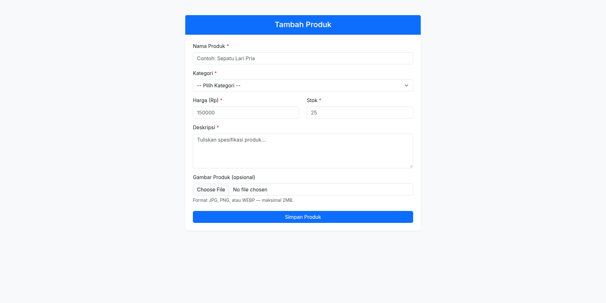

# Tugas Sesi 7 : PHP



## Deskripsi

Tugas sesi 7 adalah projek sederhana berbasis PHP yang terdiri dari dua bagian, yaitu latihan syntax dasar PHP (variabel, operator ternary, interpolasi string, dan pengecekan tipe data) serta pembuatan form input produk beserta proses validasi dan uploading gambarnya.

## Fitur

- Latihan variabel, operator ternary, dan interpolasi string
- Pengecekan tipe data menggunakan `is_int`, `is_float`, `is_string`, `is_array`, `is_object`, dan `is_resource`
- Form tambah produk (nama, kategori, harga, stok, deskripsi) menggunakan Bootstrap 5
- Sanitasi input dengan `trim` dan `strip_tags`
- Validasi server-side dengan pesan error per field dan penandaan `is-invalid`
- Penyimpanan pesan error, input lama, dan flash message melalui `session`
- Upload gambar produk opsional (JPG/PNG/WEBP, maksimal 2MB) dengan nama file unik
- Pola Post/Redirect/Get agar form tidak terkirim ulang saat refresh

## Dibangun Menggunakan

- PHP
- HTML5
- Bootstrap 5.3
- Session & file upload bawaan PHP

## Cara Menjalankan

Karena berupa file PHP, jalankan melalui PHP built-in server dari dalam folder `sesi-7`:

```bash
php -S localhost:8000
```

Kemudian buka `http://localhost:8000` di browser. Pastikan ekstensi `session` aktif dan folder `uploads/products/` dapat ditulis oleh server web.

## Struktur File

```
├── index.php                  # Latihan syntax dasar PHP
├── product_input_form.php     # Form input produk (Bootstrap 5)
├── product_input_process.php  # Proses validasi & upload gambar
├── uploads/
│   └── products/              # Folder penyimpanan gambar produk
├── thumbnail.png              # Gambar thumbnail
└── README.md                  # Deskripsi
```