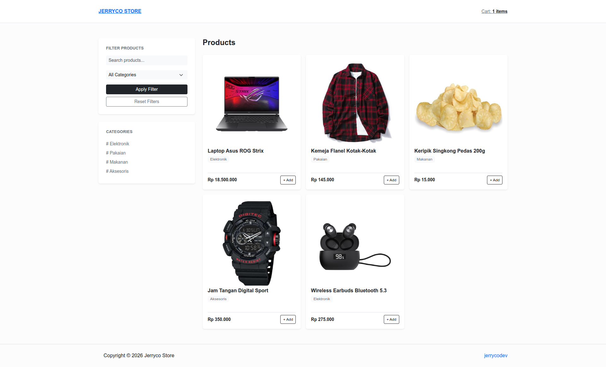

# Tugas Sesi 9 : PHP E-Commerce



## Deskripsi

Tugas sesi 9 adalah projek e-commerce sederhana berbasis PHP dan MySQL yang menyediakan katalog produk, manajemen produk, keranjang belanja, checkout, dan invoice pesanan.

## Fitur

- Menampilkan katalog produk dengan filter kategori dan pencarian nama
- Melihat detail produk dan ketersediaan stok
- CRUD produk dan upload gambar produk
- Validasi input dan notifikasi menggunakan session
- Menambahkan, mengubah kuantitas, dan menghapus produk dari keranjang
- Checkout dengan data pengiriman dan ringkasan pesanan
- Penyimpanan pesanan menggunakan database transaction
- Menampilkan invoice beserta detail item pesanan

## Dibangun Menggunakan

- PHP
- MySQL
- PDO
- Bootstrap 5.3
- HTML5
- JavaScript (Vanilla)

## Cara Menjalankan

1. Import file `database.sql` ke MySQL.
2. Sesuaikan nama database, username, dan password pada `koneksi.php`.
3. Jalankan PHP built-in server dari dalam folder `sesi-9`:

```bash
php -S localhost:8000
```

Kemudian buka `http://localhost:8000` di browser. Pastikan folder `uploads/` dapat ditulis oleh server web.

## Struktur File

```
├── index.php                  # Katalog produk dan filter
├── detail_product.php         # Detail produk
├── cart.php                   # Keranjang belanja
├── checkout.php               # Form checkout
├── invoice.php                # Invoice pesanan
├── products/
│   ├── index.php              # Daftar dan manajemen produk
│   └── form/index.php         # Form tambah/edit produk
├── actions/                   # Proses CRUD produk, cart, dan order
├── template/                  # Template header, footer, alert, dan head
├── uploads/                  # Gambar produk
├── config.php                # Konfigurasi URL dan upload
├── koneksi.php               # Konfigurasi koneksi PDO
├── session.php               # Inisialisasi session dan cart
├── database.sql              # Struktur dan contoh data database
├── thumbnail.png             # Gambar thumbnail
└── README.md                 # Deskripsi
```
